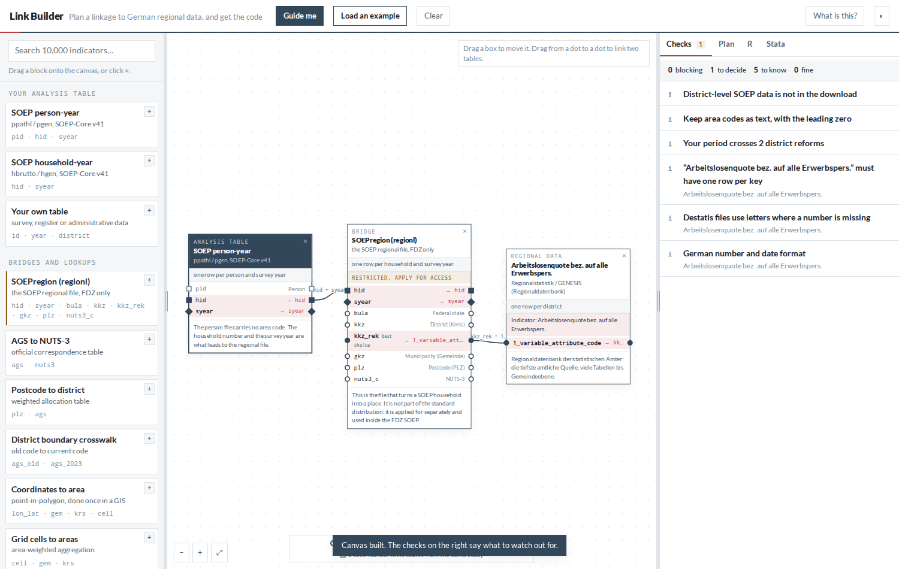

# GeoLAB Link Builder

Plan a linkage between microdata and German regional data, see what it gets wrong, and get the
R and Stata code for it.

**Live (unlisted work in progress):** <https://geolab.soz.uni-bielefeld.de/tools/link-builder/>



## What it is for

Attaching regional figures to individual-level data looks like a one-line join and is not. Area
codes change when districts merge, postcodes and constituencies cross district boundaries instead
of nesting inside them, coordinates have to become an area before anything can be joined to them,
a reference date of 31 December is not an annual average, and a lookup table with one row too many
multiplies your sample. Every one of those fails silently: the code runs, the numbers look
plausible, and nobody notices for months.

This page lets you lay the linkage out as a picture, tells you which of those traps your
particular design walks into, and writes the script with the guards already in it. It never
touches your data and runs nothing.

## What it does

- **A canvas.** Each block is a table; each row inside it is a column you could match on. Drag
  between two dots to link them. Area codes and dates are marked as the columns that link
  *different sources*; a case number links tables from the *same study*.
- **Checks in plain language**, updated as you build: level mismatches, year coverage, the five
  district reforms that break a time series, leading zeros, row multiplication, the Destatis
  legend characters, confidentiality of the SOEP regional data, and more.
- **A button on every check.** Where the remedy is unambiguous the check applies it: insert the
  crosswalk a postcode-to-district link needs, switch to a boundary-recoded key, add the
  aggregation step, keep only the largest share of a weighted crosswalk, cut the analysis period
  to the overlap. The generated code changes with it. Where the call is yours to make, the button
  takes you to the place where you make it: the palette group, the block, the link, or the exact
  line in the script.
- **R and Stata output** with the guards in place: keys read as text, uniqueness asserted before
  the join, `relationship = "many-to-one"` / `merge m:1`, and a diagnostic for what did not match.
- **Search over ~10,000 indicators**, asking the live [GeoDB finder][geodb] API, so it ranks them
  exactly as the finder does and asking in English finds German records. Every finder result links
  into this page with the indicator chosen, and every block here links back into the finder.

[geodb]: https://geodb.geolab.soz.uni-bielefeld.de/

## Running it

Three static files and a JSON. No build step, no dependencies.

```bash
python3 -m http.server 8000     # then open http://localhost:8000/
```

The search calls the GeoDB API and falls back to the bundled catalogue when that is unreachable;
a browser other than the deployed origin will be refused by CORS and use the fallback.

## Rebuilding the catalogue

`catalogue.json` is generated from the GeoDB index, which lives in a separate repository:

```bash
python3 scripts/build_linkbuilder_catalogue.py
```

It is a generated artifact. Corrections go in the script, never in the JSON.

## Where this comes from

Part of the [GeoLAB](https://geolab.soz.uni-bielefeld.de/) of the Leibniz ScienceCampus
SOEP-RegioHub at Bielefeld University and DIW Berlin. The SOEP structure follows SOEP-Core v41;
the indicator catalogue comes from the GeoDB Geodata Index.

`CLAUDE.md` holds the inside view: the domain model, the traps found while building it, and how
to check a change.

## Licence

MIT, see `LICENSE`. The catalogue describes data published by other institutions; each record
links to its source, and nothing in this repository redistributes their data.
